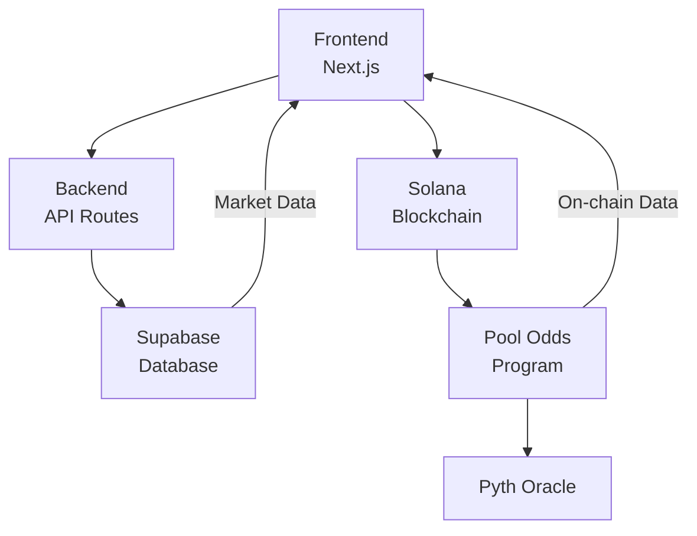
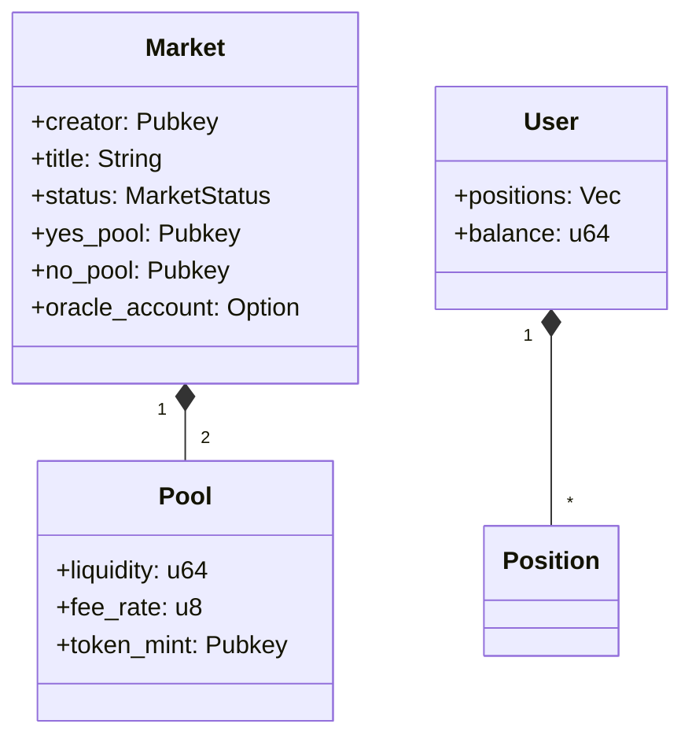
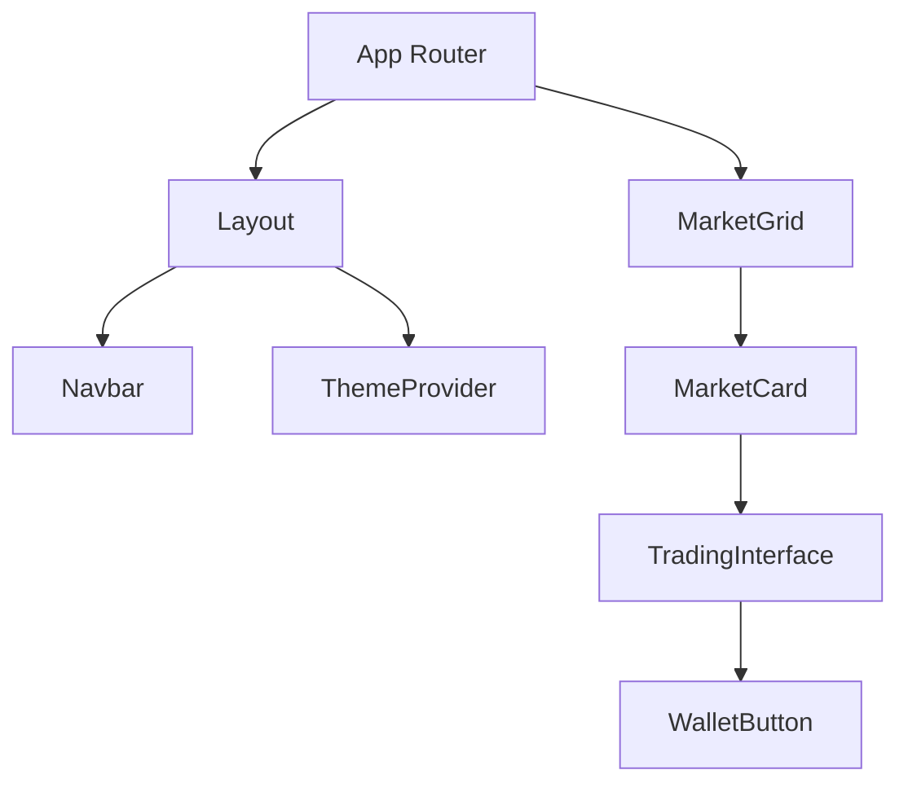

# Solana Prediction Market 

A simple Solana-based prediction market platform powered by Meteora's Dynamic Liquidity Market Makers (DLMM) SDK, built with the Anchor framework.



## 🌟 Overview

Solana prediction markets by using liquidity depth to determine market confidence and odds, rather than just token prices. The deeper the liquidity pool, the more confident the market prediction becomes.

## Contact

If you have any question, contract here: [Telegram](https://t.me/shiny0103)

## Relation projects

- [Smart Contract](https://github.com/L9T-Development/prediction-market-contract-main-solana)

### Key Features

- **🏊 Dual Pool Architecture**: Separate YES/NO liquidity pools for each market
- **📊 Liquidity-Weighted Odds**: Market confidence based on pool depth
- **🔮 Oracle Integration**: Automated resolution via Pyth Network
- **💰 Dynamic Fees**: Fee rates adjust based on pool imbalances
- **🛡️ Security First**: Comprehensive validation and overflow protection
- **⚡ High Performance**: Optimized for Solana's speed and efficiency

## 🏗️ Architecture

### Core Components

1. **Global State**: Program-wide configuration and statistics
2. **Markets**: Individual prediction markets with metadata
3. **Pools**: YES/NO liquidity pools using constant product AMM
4. **Positions**: User trading positions and P&L tracking
5. **Users**: User statistics and activity tracking



### Account Structure

#### Market Account
```rust
pub struct Market {
    pub creator: Pubkey,           // Market creator
    pub title: [u8; 64],          // Market question
    pub status: MarketStatus,      // Active/Resolved/Cancelled
    pub end_time: i64,             // Resolution deadline
    pub yes_pool: Pubkey,          // YES outcome pool
    pub no_pool: Pubkey,           // NO outcome pool
    pub oracle_account: Option<Pubkey>, // Price feed
    pub target_price: Option<u64>, // Oracle target
    // ... additional fields
}
```

## 🖥️ Development

### Frontend Architecture
- Next.js 14 App Router
- Tailwind CSS with custom configs
- Radix UI component library
- Wallet integration via @solana/wallet-adapter



## 🧪 Testing
Run the full test suite:
```bash
pnpm test:all  # Runs both frontend and program tests
```

## 🚢 Deployment
```bash
# Frontend
pnpm build
pnpm start

# Program
anchor deploy --provider.cluster mainnet-beta
```

## 🤝 Contributing
1. Fork the repository
2. Create your feature branch
3. Submit a pull request

## 🚧 Known Issues & Roadmap

### Critical Priority (Must Fix Immediately)

#### Database Relationships
- **Issue**: Manual joins in `lib/database-service-relationship-fix.ts` instead of proper constraints
- **Solution**: 
  - Add foreign key constraints in Supabase schema
  - Update schema in `scripts/001-initial-schema.sql`
  - Remove manual join logic from service
- **Files to Modify**:
  - `scripts/001-initial-schema.sql`
  - `lib/database-service-relationship-fix.ts`

#### Fee Distribution
- **Issue**: Unimplemented in `lib/dlmm-real-fixed.ts`
- **Solution**:
  - Implement fee collection during swaps
  - Distribute fees proportionally to liquidity providers
  - Add fee tracking in database
- **Files to Modify**:
  - `lib/dlmm-real-fixed.ts`
  - `lib/database-service-fixed.ts`
  - `types/database-fixed.ts`

#### Oracle Integration
- **Issue**: Limited to ETH/BTC/SOL markets in `lib/dlmm-real-fixed.ts`
- **Solution**:
  - Make oracle symbol configurable per market
  - Add dynamic price feed resolution
  - Support custom target prices
- **Files to Modify**:
  - `lib/dlmm-real-fixed.ts`
  - `types/market.ts`
  - `programs/pool-odds/src/lib.rs`

#### Token Mints
- **Issue**: Placeholder tokens in swap functionality (`lib/dlmm-real-fixed.ts`)
- **Solution**:
  - Use real token mints from market configuration
  - Add token mint validation
  - Update swap transaction builder
- **Files to Modify**:
  - `lib/dlmm-real-fixed.ts`
  - `lib/transaction-service.ts`
  - `types/dlmm.ts`

### High Priority (Next Sprint)
- **Service Consolidation**: Competing fixed vs standard implementations
- **Market Resolution**: Complete for all market types
- **Error Handling**: Enhance recovery and consistency
- **Configuration**: Replace hardcoded values with config system

### Medium Priority
- **UI Loading States**: Add skeletons and better loading indicators
- **Market Stats**: Tooltips and explanations
- **Health Checks**: Comprehensive system monitoring
- **Testing**: Expand test coverage

### Low Priority (Technical Debt)
- **Style System**: Standardize CSS classes
- **Error States**: Improve UI for error conditions
- **Fallbacks**: Refine fallback mechanisms
- **Logging**: Enhance logging granularity

## 📄 License
MIT
